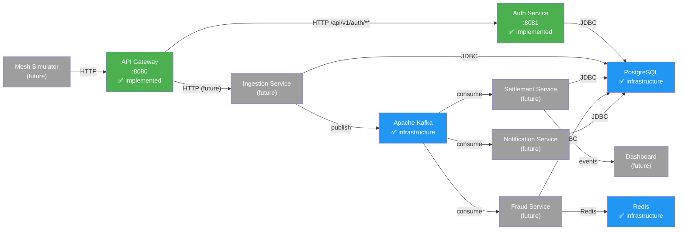

# High-Level Design

## Purpose

This document describes the MeshPay system architecture, service boundaries, data ownership, and communication patterns. It reflects the actual state of the repository — distinguishing what is currently implemented from what is planned for Phase 2.

## System Overview

MeshPay is a distributed-systems simulation for offline UPI-style payments over a device-to-device mesh network. A mesh simulator generates payment requests that flow through an API gateway, get authenticated, ingested, evaluated for fraud, settled, and result in notifications.

## Architecture Diagram

Green = currently implemented. Gray = planned for Phase 2. Blue = infrastructure.

## Service Responsibilities

### API Gateway (implemented)

- Entry point for all client HTTP requests
- Routes requests to downstream services
- Generates and propagates `X-Correlation-ID`
- Rate-limit integration point (stub — currently allows all)
- Runs on port 8080
- Built with Spring Cloud Gateway (reactive/WebFlux)

### Auth Service (implemented)

- Bridge registration with BCrypt credential hashing
- Credential verification and JWT token issuance
- JWT validation for protected endpoints
- Owns `auth_db`
- Runs on port 8081
- Built with Spring Boot, Spring Security, JPA, Flyway

### Ingestion Service (planned)

- Receives validated payment requests
- Performs idempotency checks
- Publishes `PaymentSubmitted` events to Kafka
- Owns `ingestion_db`

### Settlement Service (planned)

- Processes payment lifecycle transitions
- Validates account balances
- Maintains ledger entries
- Publishes `PaymentSettled` events to Kafka
- Owns `settlement_db`

### Fraud Service (planned)

- Rule-based fraud evaluation
- Velocity checks using Redis
- Risk classification and bridge reputation
- Publishes fraud evaluation results to Kafka
- Owns `fraud_db`

### Notification Service (planned)

- Handles notification dispatch after settlement or fraud events
- Owns `notification_db`

### Mesh Simulator (planned)

- Simulates mesh network payment clients
- Generates test requests for the full payment flow

## Data Ownership

Each service owns its logical database. One PostgreSQL container is used for local development, but databases provide service-level ownership boundaries.

| Service | Database | Status |
|---------|----------|--------|
| Auth Service | `auth_db` | ✅ implemented |
| Ingestion Service | `ingestion_db` | planned |
| Settlement Service | `settlement_db` | planned |
| Fraud Service | `fraud_db` | planned |
| Notification Service | `notification_db` | planned |

Services must not directly access each other's databases. Cross-service data access happens through Kafka events or service APIs.

## Communication Patterns

### Synchronous (HTTP)

| From | To | Protocol | Status |
|------|----|----------|--------|
| Client | Gateway | HTTP | planned (mesh simulator) |
| Gateway | Auth Service | HTTP | ✅ implemented |
| Gateway | Ingestion Service | HTTP | planned |

All synchronous traffic flows through the Gateway. Services are not called directly by clients.

### Asynchronous (Kafka)

| Topic | Producer | Consumer | Status |
|-------|----------|----------|--------|
| `meshpay.payment.ingested` | Ingestion Service | Settlement Service | planned |
| `meshpay.payment.settled` | Settlement Service | Fraud Service, Notification Service | planned |
| `meshpay.fraud.events` | Fraud Service | Settlement Service | planned |
| `meshpay.notification.events` | Notification Service | — | planned |
| `meshpay.dead-letter` | Any service | Operations | planned |

All asynchronous communication uses the event envelope contract defined in [event-contracts.md](event-contracts.md).

## Failure Boundaries

| Boundary | Failure Mode | Current Behavior |
|----------|-------------|-----------------|
| Client → Gateway | Network error | Client receives connection error |
| Gateway → Auth Service | Auth Service down | Gateway returns 5xx (does not fake success) |
| Service → Kafka | Kafka unavailable | Planned: events queue locally, retry |
| Kafka → Consumer | Consumer processing error | Planned: dead-letter queue |
| Service → PostgreSQL | Database unavailable | Planned: service fails fast, health check reports DOWN |
| Service → Redis | Redis unavailable | Planned: degraded mode (no velocity checks) |

Correlation IDs are preserved across failure boundaries. When Auth Service is down, the Gateway still returns the `X-Correlation-ID` in its error response.

## Infrastructure

| Component | Version | Port | Purpose |
|-----------|---------|------|---------|
| PostgreSQL | 18 | 5433 | Relational storage (5 logical databases) |
| Redis | 8.10.1 | 6379 | Fast state: idempotency, velocity, rate limiting |
| Apache Kafka | 4.3.1 (KRaft) | 9092 | Event backbone |

Kafka runs in KRaft mode — no ZooKeeper dependency.

## Architectural Constraints

- Services are independently deployable
- Each service owns its data
- Cross-service data access is forbidden — use APIs or events
- All events follow the canonical envelope contract
- Timestamps are UTC
- Correlation IDs propagate across all boundaries
- No service directly calls another service's database

## Phase 1 / Phase 2 Boundary

### Phase 1 (complete after Day 4)

- Infrastructure: PostgreSQL, Redis, Kafka
- Auth Service: bridge registration, JWT authentication
- API Gateway: routing, correlation ID, rate-limit stub
- Event contract and high-level design documentation

### Phase 2 (starts after Day 4)

- Ingestion Service and event production
- Settlement Service and payment lifecycle
- Fraud Service and risk evaluation
- Notification Service
- Kafka producer/consumer implementations
- Payment processing pipeline
- Mesh Simulator
- Dashboard

## Current Implementation Status

| Component | Status |
|-----------|--------|
| PostgreSQL (docker) | ✅ running |
| Redis (docker) | ✅ running |
| Kafka (docker) | ✅ running |
| Auth Service | ✅ implemented and tested |
| API Gateway | ✅ implemented and tested |
| Gateway → Auth routing | ✅ working |
| Correlation ID | ✅ working |
| Rate limit stub | ✅ working |
| Ingestion Service | .gitkeep placeholder |
| Settlement Service | .gitkeep placeholder |
| Fraud Service | .gitkeep placeholder |
| Notification Service | .gitkeep placeholder |
| Mesh Simulator | .gitkeep placeholder |
| Frontend / Dashboard | .gitkeep placeholder |
